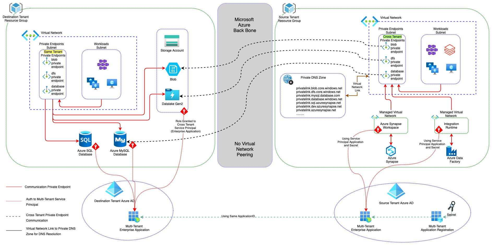
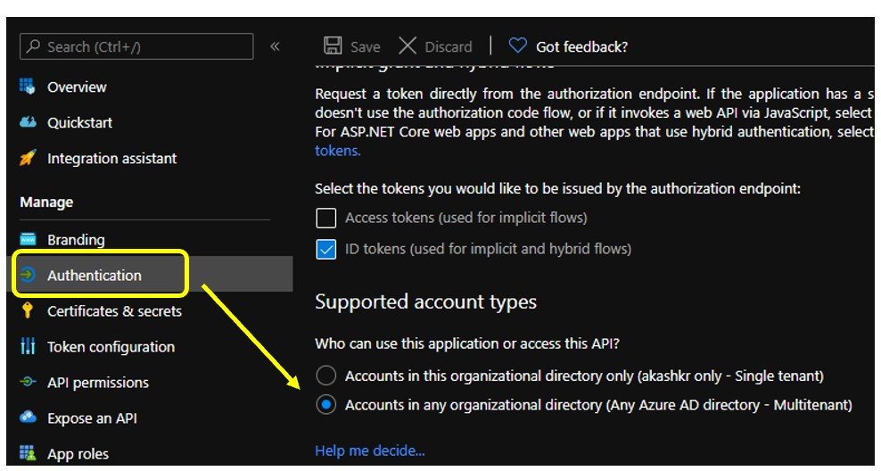
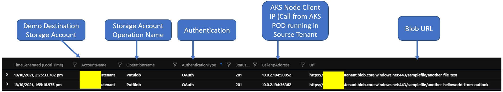

# Azure Cross Tenant Access (Authentication, Authorization, Private Communication).

There are two idependent Azure tenants, across which we shall try to build authentication, authorization. Subsequently, we shall have secure private connectivity between both tenant so that communication does not traverse through internet and remain private. 
- **Source Tenant**: Tenant which is Central Identity Store. This identity store (Azure AD) will create and store Service Principals. In Source Tenant, We are processing data residing in Destination tenant.
- **Destination Tenant**: Tenant where data is coming in and residing. Data from this tenant can not move out. It is data store.

>  **Note:** [Have understanding in Azure Active Diretory what is Application Registration, Enterprise Application (Service Pricipal)](https://docs.microsoft.com/en-us/azure/active-directory/develop/app-objects-and-service-principals)

## Requirements:

- Systems, running in Source Tenant, should be able to reach Destination Tenant. 
- While doing so, proper secured authentication and authorization should be performed.
- For authentication in Destination Tenant, no guest account access should be used.
- Request should not traverse through Internet and traffic should remain total private.
- Source and Destination tenant can not have any sort of Virtual Network Peering or Mesh Private Connectivity between them.
- All requests at Source Tenant and Destination on Identity, Connectivity and Data Layer should be logged in loganalytics for compliance purpose.
- No Private IP hardcoding should be used in any system. Proper FQDNs based DNS resolution happen while accessing/processing data.

## Solution:

- Use Multi-tenant Azure AD Service Principal (Enterprise Application) to authenticate across Source and Destination Tenants.
- Use Cross Tenant Private Endpoint to access resources over Private Network (Microsoft Backbone Network), without having any Virtual Network Peering or Mesh Private Connectivity
- Centralized Azure Private DNS Zone for DNS Resoluation for Cross Tenant DNS resolution to Private Endpoint

    

## Pre-requisites:

- Source and Destination Tenant Administrative Rights to create Application under Application Registration
- Have a virtual network with subnet (ideally) to be used for Private Endpoint, in Source Tenant. 
- Source and Destination Tenant Administratibe Rights to create cross tenant Private Endpoint Request (at Source Tenant) And Approval (at Destination Tenant)
- Sufficient IAM Role to assign IAM to Service Principal (created above) on Azure resource example: Storage/DB/Redis/AKS etc. (at Destination Tenant). 
	- Atleast, Azure Resource Manager Reader role
	- For Storage Access (example), data access role, such as Storage Blob Data Contributor
    - Define your IAM strategy accordingly. Treat both Control Plane and Data Plane permission [Good Azure Document to Refer](https://docs.microsoft.com/en-us/azure/storage/blobs/assign-azure-role-data-access?tabs=portal)
- If using existing Centralized Azure Private DNZ Zone (in our case we are using), atleast Private DNZ Zone Contributor to allow you to create DNS Record for Existing Private Endpoint


# Technical Steps

## Create Cross Tenant Application 

### Source Tenant Service Principal Creation
1. Have Service Principal in Source Tenant Identity Store (AAD)
```
az ad sp create-for-rbac -n "cross-tenant-app"
```
2. Retrieving and verifying details

    2.1. Note down Application ID and Secret generated in Source Tenant
    
    2.2. Verify Application ID Listed in Application Registration (as **Application (client) ID**) and 'Enteprise Application' (as **Application ID**). 

3. Go to Application Registration/Authentication and Enable for ApplicationID 'Accounts in any organizational directory (**Any Azure AD directory - Multitenant**)

    

4. By doing these steps, a multi-tenant Service Principal has been created in Source Tenant.


### Destination Tenant Service Principal Mapping to Source Tenant Multitenant Service Principal
Now we need to create Service Principal using same Application ID (which are globally unique), created in Source tenant. 
>  **Note:** As you noticed in Step 3. We have enabled Multi-tenant AAD authentication. So we should be able to use same details (including secrets) to operate in Destination tenant.
5. Login Now into Destination Tenant and create Service Principal using same Application ID retrieved from Step 2.1 above
```
az ad sp create --id “ApplicationID From Step 2.1” 
```
6. No Need for New Secret as Source Tenant (Step 2.1) secret will be utilized 
7. Verify ApplicationID listed only in **Enterprise Application**, NOT under 'Application Registration' [Review Microsoft Documentation what is Service Principal. How ApplicationID and Enteprise Application work together](https://docs.microsoft.com/en-us/azure/active-directory/develop/app-objects-and-service-principal) 
8. Since Application is registered in Source Tenant as Multitenant Application, You will not find it under Application Registration of Destination Tenant.

## Build Private Connectivity and Perform End to End Test 

As we have created multi-tenant Service Principal, next we shall set up connectivity;
- Create Cross Tenant Private Endpoint in Source Tenant targeting Workload in Destination Tenant
- Approve Cross Tenant Private Endpoint in Destination Tenant, for the request comming from Source Tenant for specific Workload
- Create and Mapp to Private DNS Zone for Private Endpoint in Source Tenant.
>  [**End to End Steps for Cross Tenant Private Endpoint Creation/Approval/DNS Zone Mapping mentioned here**](cross_tenant_pvtendpoint.sh)

- After previous steps is being performed, Perform Test for;
    > I am using Azure Storage (blob) as Sample to simulate. Using same process, it can be done for any PaaS workload.
    - *Authentication*: Using multi-tenant workload Service Principal, login in Destination Tenant. You can use Azure Cloud Shell for this.
    
    ```
    az login --service-principal -u <ApplicationID in retrieved from Step 2.1> -p <Password for ApplicationID in retrived from Step 2.1> --tenant <Destination Tenant ID>
    
    az account show -o table
    ```
    - Check you are in right tenant in your output and tenant and subscription details.
    - *Authorization*: Assuming you have assigned permission to destination storage account, you should be able to see storage list which Service Principal has access
    ```
    az storage account list -o table
    ```
    - *Connectivity*: From **Source Tenant**, we shall login into **Destination Tenant**, then call out Storage Account and perform Upload/Download function leveraging current logged in session to test. We shall also check if storage account URL is resolving to public IP or private IP to confirm if traffic going to Public.
        - You can either use VM Linux or AKS Cluster in same Virtual Network where Private Endpoint Subnet residing. 
        > *If you have hub-spoke, pattern still works perfectly fine. Just you need to plan routing, DNS resolution (either using custom DNS or Using Vnet Linking)*
        - Inside Linux VM install AzCli OR in AKS Cluster spin up Container with *--image=mcr.microsoft.com/azure-cli*, then do exec into POD to perform test operation 
        ```
        az login --service-principal -u <ApplicationID in retrieved from Step 2.1> -p <Password for ApplicationID in retrived from Step 2.1> --tenant <Destination Tenant ID>
        az account show -o table
        az storage account list -o table
        touch sample_doc.txt
        az storage blob upload --account-name <mystorageaccount> --auth-mode login --container-name <mycontainer> --file /path/to/file --name <myblob>
        ```
    - *Logging*: Have diagnostic enable in both Source and Destination Tenant for all the workload use in testing i.e. Storage/Private DNS etc. After you can check how storage is being queried. Key to check, Auth-mode (should be Oauth)/ClientIP (should be private)/Action (should show list/upload or whatever action you performed)
        ```
        StorageBlobLogs
        | where TimeGenerated > ago(1d) //Change duration based upon your testing
        | sort by TimeGenerated 
        | project TimeGenerated, AccountName, OperationName, AuthenticationType, StatusCode, CallerIpAddress, Uri
        ```
        
    
    - *DNS Resolution*: Peform *dig* or *nslookup* to storageaccount url and see what come in response. Results Should look below for Private IP Resolution to Storage FQDN
        - Both source Tenant PE and destination Tenant PE sitting under source Private DNS Zone Resolving to Private IP
        - SSH or Exec and perform test. 
        > *Note: These are sample storage account (non-existent)*
        ```
        admin@cross-tenant-vm:~$ nslookup sourcetenant-sa.blob.core.windows.net
        Server:         127.0.0.53
        Address:        127.0.0.53#53
        Non-authoritative answer:
        sourcetenant-sa.blob.core.windows.net      canonical name = sourcetenant-sa.privatelink.blob.core.windows.net.
        Name:   sourcetenant-sa.privatelink.blob.core.windows.net
        Address: 10.0.1.4
        admin@cross-tenant-vm:~$ nslookup destinationtenant-sa.blob.core.windows.net
        Server:         127.0.0.53
        Address:        127.0.0.53#53
        Non-authoritative answer:
        destinationtenant-sa.blob.core.windows.net canonical name = destinationtenant-sa.privatelink.blob.core.windows.net.
        Name:   destinationtenant-sa.privatelink.blob.core.windows.net
        Address: 10.0.1.5
        ```
> Please feel free to share inputs or contribute if you have any ideas/suggestions.